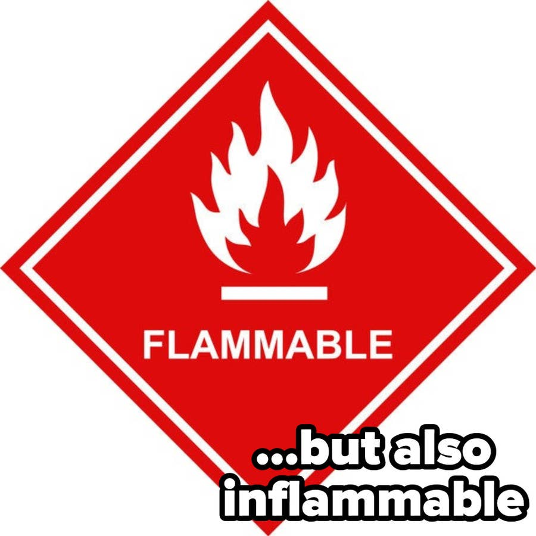
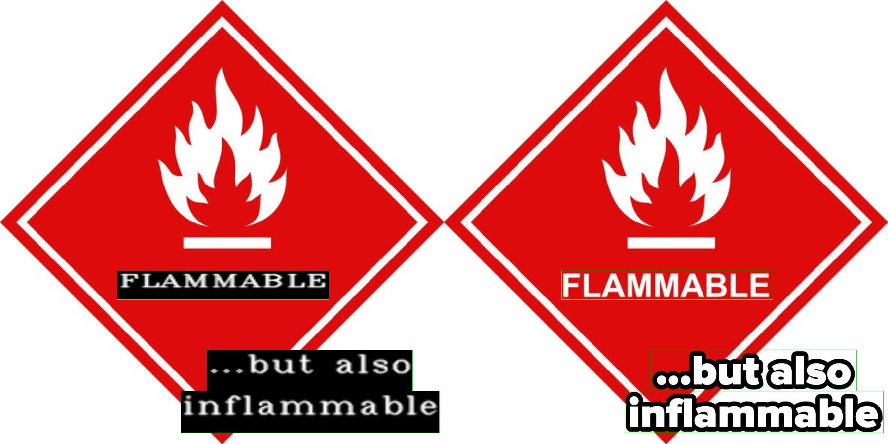
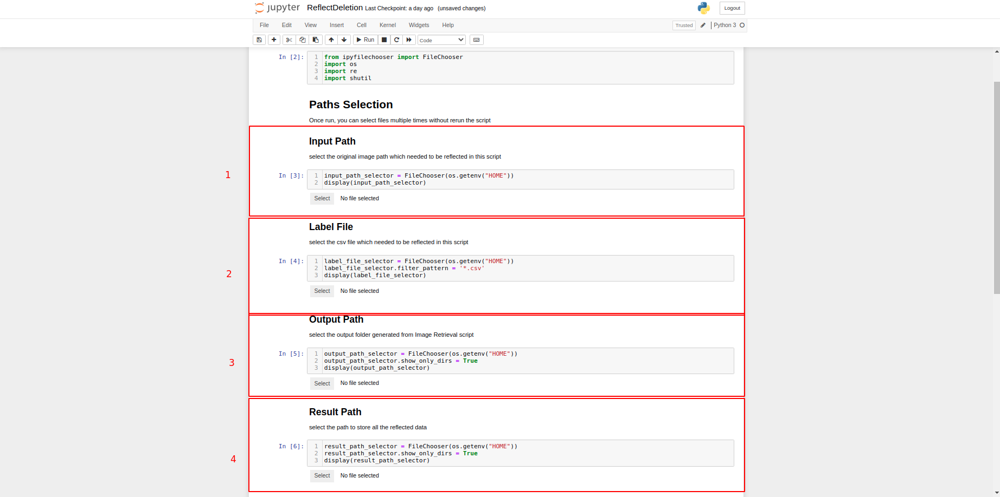

# OCR Image Retrieval

OCR Image Retrieval consists of 3 scripts [ImageRetieval](ImageRetrieval.ipynb), [ImageFiltering](ImageFiltering.ipynb) and [FolderMerging](FolderMerging.ipynb).

## Sequence of Usage

1. ImageRetrieval: Retrieve annotated image for quality checking
2. ImageFiltering: Perform deletion of image if required
3. FolderMerging: Merge multiple small folders into one folder

## User Guide

### ImageRetrieval

**Step 1: Select all path**

1. Image Path : folder that contains the images
2. Label File : csv label file
3. Output Path : folder for output images

    Output Path structure
    
    ```
    .
    +-- Output Path
        +-- Image Path Name
            +-- <<images>>    
    ```

**Step 2: Run Script**

#### *Sample Output*

Image:

<p align="center">
  
</p>

Output:




### ImageFiltering

**Step 0: Image Filtering**

In order to use this script, *ImageRetrieval* script must be run first. In the output folder, the image to be filtered must be deleted. This script will read the remaining files in folder, copy the original image, perform updates to label file.

**Step 1: Select all path**

1. Input Path : folder that contains the original images
2. Label File : csv label file 
3. Output Path : folder that contains all the output images generated by *Image Retrieval* script.

    Output Path Structure from *Image Retrieval* script
    ```
    .
    +-- Output Path
        +-- Image Path Name   <--- select this folder
            +-- <<images>>    
    ```
4. Result Path : Location for contain all the original images expect the deleted images previously.

    Result Path Structure
    ```
    .
    +-- Result Path
        +-- Image Path Name   
            +-- <<images>>
            +-- csv file   
    ```
**Step 2: Run Script**

#### *Output*
In the result path, there will be a duplicate of input folder with filtering reflected. The modified csv will be put into the folder as well.

### FolderMerging
**Step 0: Before running the script**

In order to use this script, the folder structure must be same as the diagram

Input Path Structure
```
.
+-- Input Path 
    +-- Image Folder 1   
    |   +-- <<images>>
    |   +-- csv file
    |
    +-- Image Folder 2   
    |   +-- <<images>>
    |   +-- csv file
    .
    .    
```

**Step 1: Select all path**

1. Input Path : Select the folder that contains the original images (which you created in step 0)
   
    Input Path Structure
    ```
    .
    +-- Input Path <-------------- select this folder
        +-- Image Folder 1   
        |   +-- <<images>>
        |   +-- csv file
        |
        +-- Image Folder 2   
        |   +-- <<images>>
        |   +-- csv file
        .
        .    
    ```
2. Output Path : Select the folder that contains all the output images generated by *Image Retrieval* script

    Output Path Structure
    ```
    .
    +-- Output Path
        +-- Input Path Name  
            +-- <<merged images>>
            +-- merged csv file  
    ```
**Step 2: Run Script**
#### *Output*
In the result path, there will be a duplicate of image folder with all images in sub-folders are merged and renamed. The modified csv will be put into the folder and renamed as label.csv.

