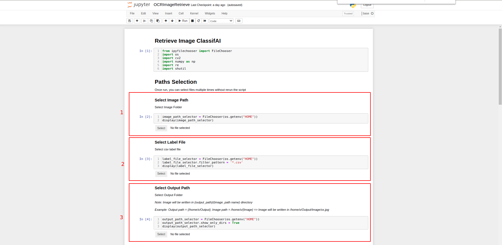
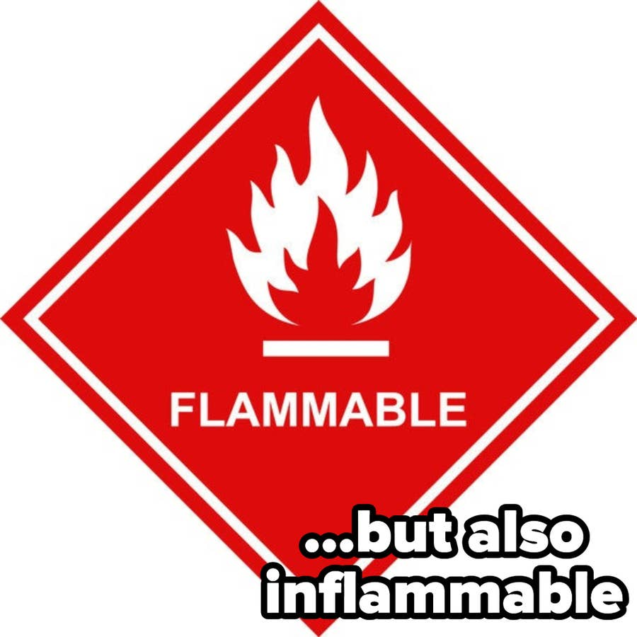
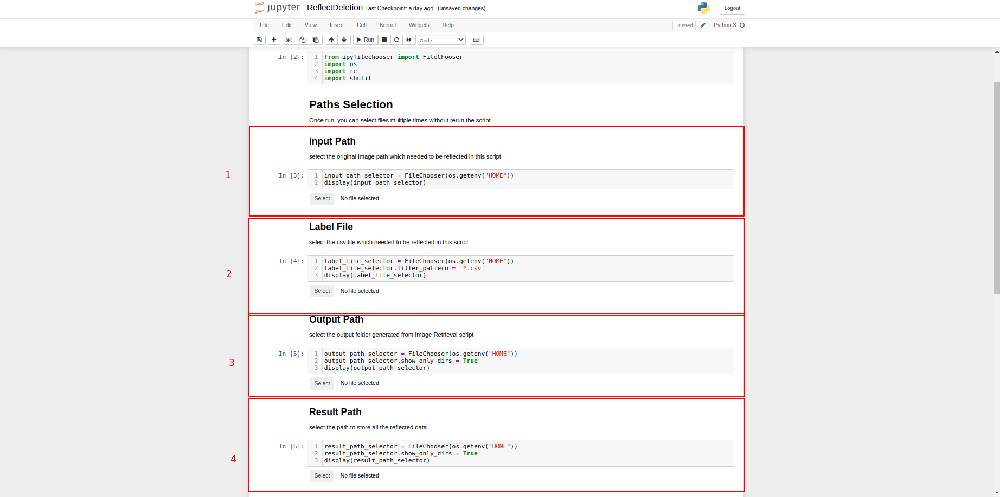
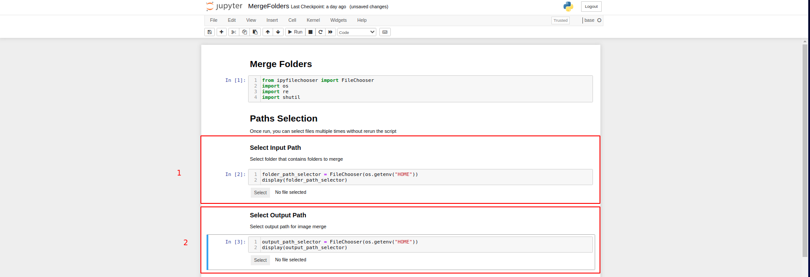

# OCR Image Retrieval

OCR Image Retrieval consists of 3 scripts [Image Retieval](OCRImageRetrieve.ipynb), [Reflect Deletion](ReflectDeletion.ipynb) and [Merge All Folders](MergeFolders.ipynb).

Normally, images are annotated in batches, hence resulting many small folders will be created.
*Merge All Folders* script helps you to merge and rename all the folders into one, also rename all images into more systematic way for the ease of data processing.

## Image Retrieval
If you are only interested to retrieve the annotated result, you will only require to use the *Image Retrieval* script. This script will generate side-by-side view of original and annotated output of image. 

The output images will be in a new output folder decided by users.
### User Guide
**Step 1: Select all path**

1. Image Path : Select the folder that contains the images
2. Label File : Select the csv label file respect to the image path selected in image path
3. Output Path : Select the location for output images

**Step 2: Run Script**

### Sample Output

Image:

  

Output:

## Reflect Deletion
*Reflect Deletion* script is used when you are required to discard images based on the result. It will create a new folder and csv label file that only contains all the good quality image.

### User Guide
**Step 0: Perform Image filtering**

For the output image generated by *Image Retrieval* script, if you want to filter out any image. You just need to delete it directly in the output path. When you are good to go, run this script to do the rest of the job.

**Step 1: Select all path**

1. Input Path : Select the folder that contains the original images
2. Label File : Select the csv label file respect to the image path selected in image path
3. Output Path : Select the folder that contains all the output images generated by *Image Retrieval* script
4. Result Path : Select the location for contain all the original images expect the deleted images previously.

**Step 2: Run Script**

### Output
In the result path, there will be a duplicate of input folder with filtering reflected. The modified csv will be put into the folder as well.

## Merge All Folders
Merge All Folders is the script that help to merge all separated folders of image into one folder, one csv label file and also provide renaming for all images.

### User Guide
**Step 0: Before running the script**

You are required to put all folders that are going to be merged into one folder. Make sure csv label file is in the respective folder as well.

**Step 1: Select all path**

1. Input Path : Select the folder that contains the original images (which you created in step 0)
2. Output Path : Select the folder that contains all the output images generated by *Image Retrieval* script

**Step 2: Run Script**
### Output
In the result path, there will be a duplicate of image folder with all images in sub-folders are merged and renamed. The modified csv will be put into the folder and renamed as label.csv.

