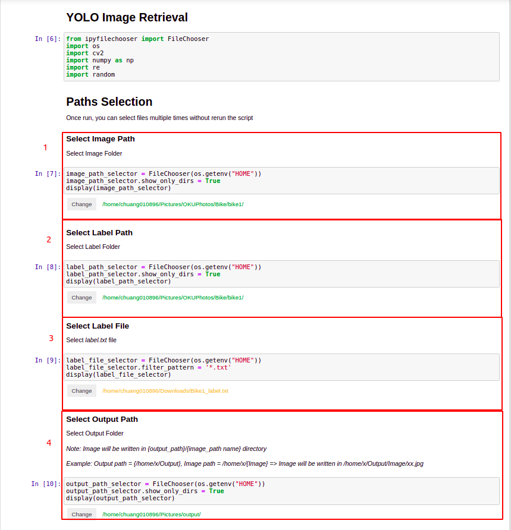

# YOLO Image Retrieval

## User Guide


**Step 1: Select all path**

1. Image Path : folder that contains the images
2. Label Path : folder that contains the label files (only txt files are required)
3. Label file : *label.txt* file
4. Output Path : folder for output images

   Output Path structure

    ```
    .
    +-- Output Path
        +-- Image Path Name
            +-- <<images>>    
    ```

**Step 2: Run Script**

#### *Sample Output*

Image:

<p align="center">
  
</p>


Output:


